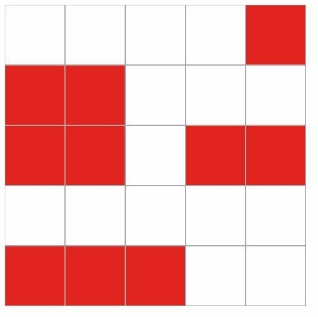
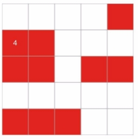

# Grid Interview Problem

## Technical Requirements
[grid-interview-problem.pdf](grid-interview-problem.pdf)


## Demo
http://KirillOFF.github.io/grid-interview-problem


# Grid Interview Problem

Grid Interview Problem 

Problem Brief 

Create an app that renders a grid of 0s and 1s, and allows you to count the number of continuous blocks of 1s. 

In Depth 

1. Create a two-dimensional array (a grid) in Javascript of 1s and 0s, for example. 

```
const grid =  [
     [ 0, 0, 0, 0, 1 ],
     [ 1, 1, 0, 0, 0 ],
     [ 1, 1, 0, 1, 1 ],
     [ 0, 0, 0, 0, 0 ],
     [ 1, 1, 1, 0, 0 ],
   ]; 
```

2. Render the above grid model on a web page using a colour to represent 1s, and empty for 0s (feel free to make it look nicer than the below). 



3. When you click on a filled square, count the number of filled squares connected to this square, and all other filled squares connected to those squares. Write this number into the clicked square. Squares are connected if they are touching horizontally or vertically, NOT diagonal. Numbers in other coloured squares should be cleared when a new square is clicked: 




4. Clicking on a non-filled square should do nothing 
4. While hovering over a filled square, temporarily change the colour of all connected squares 
4. Allow the grid to be randomly generated with size NxN elements with 0s and 1s in. Add a slider to vary N. 
4. Add a colour picker to allow the user to change the hover and background colours of the grid. 

Additional extras: 

\- Make it look nice 


